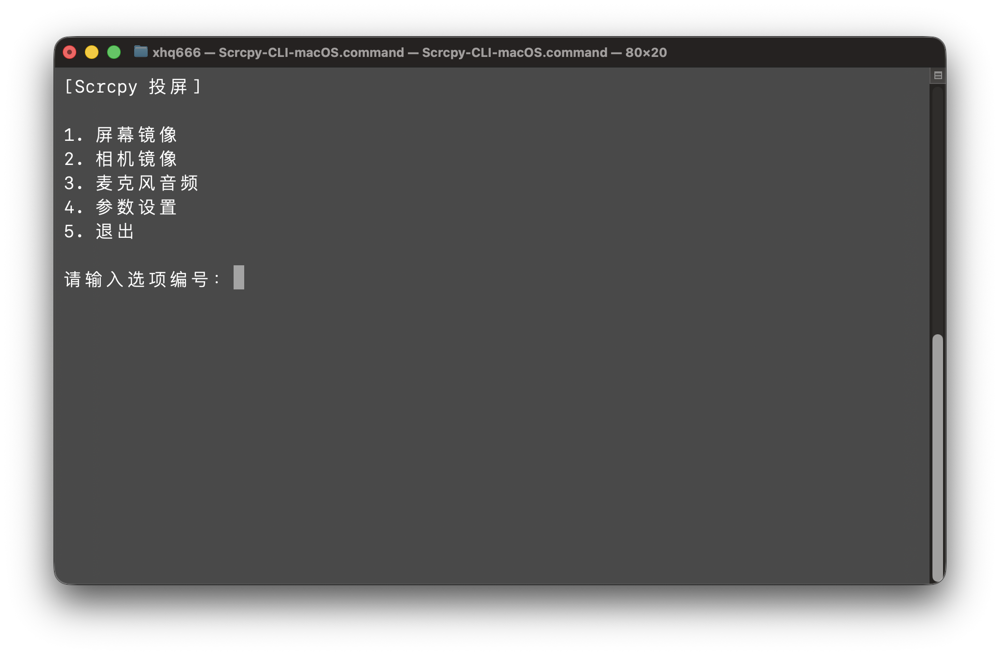

# Scrcpy CLI Launcher

English | [简体中文](./README_zh-CN.md)

A cross-platform CLI launcher for scrcpy with device selection, profiles, and quick access to common mirror modes.

This project provides an interactive menu-based wrapper around `scrcpy` and `adb`, making it easier to:

- mirror the Android screen
- mirror the camera
- capture microphone audio only
- switch between predefined launch profiles
- handle multiple connected devices
- attempt reconnection for offline ADB devices

The original version was written as a Windows batch script, and equivalent shell versions were adapted for macOS and Linux.

---

## Screenshot



## Features

### Screen mirror
Launches standard `scrcpy` screen mirroring for the selected device.

### Camera mirror
Launches `scrcpy` with:

```bash
--video-source=camera
```

Supports camera ID selection and display orientation handling.

### Microphone audio
Launches microphone-only audio forwarding with:

```bash
--audio-source=mic --no-video
```

### Profile switching
Reads from a JSON config file and allows switching between named profiles.

### Multiple devices
Detects all ADB devices and lets you choose which one to use.

### Offline device reconnect
If a device is detected as `offline`, the script attempts:

```bash
adb disconnect <device>
adb connect <device>
```

---

## Supported Platforms

- **Windows**: `.bat`
- **macOS**: `.command`
- **Linux**: `.sh`

---

## Requirements

The scripts rely on the following tools:

- **adb**
- **scrcpy**
- **Python 3**

Python 3 is used for JSON parsing and profile loading in the shell-based versions.

---

## Installation

### Windows
Install:

- `adb`
- `scrcpy`
- `PowerShell` (already included in modern Windows)

Make sure both `adb` and `scrcpy` are available in `PATH`.

### macOS
Install using Homebrew:

```bash
brew install android-platform-tools scrcpy
```

### Linux
Common package manager examples:

#### Debian / Ubuntu
```bash
sudo apt install adb scrcpy python3
```

#### Fedora
```bash
sudo dnf install android-tools scrcpy python3
```

#### Arch Linux
```bash
sudo pacman -S android-tools scrcpy python
```

These commands use **`sudo`**, which will modify system packages. Run them only if you trust your package sources and understand the impact.

---

## Configuration File

The launcher reads its configuration from:

```text
~/scrcpy_config.json
```

### Windows
This maps to something like:

```text
C:\Users\YourName\scrcpy_config.json
```

### macOS / Linux
This maps to something like:

```text
/Users/yourname/scrcpy_config.json
```

or:

```text
/home/yourname/scrcpy_config.json
```

---

## Configuration Format

Two JSON structures are supported.

### Format A: `profiles` object

```json
{
  "selected": "default",
  "profiles": {
    "default": {
      "display_mirror": "--max-size 1600",
      "camera_mirror": "--video-bit-rate 8M"
    },
    "high_quality": {
      "display_mirror": "--max-size 2560 --video-bit-rate 20M",
      "camera_mirror": "--video-bit-rate 20M"
    }
  }
}
```

### Format B: flat profile object

```json
{
  "selected": "default",
  "default": {
    "display_mirror": "--max-size 1600",
    "camera_mirror": "--video-bit-rate 8M"
  },
  "high_quality": {
    "display_mirror": "--max-size 2560 --video-bit-rate 20M",
    "camera_mirror": "--video-bit-rate 20M"
  }
}
```

### Field Description

| Field | Description |
|------|------|
| `selected` | Currently selected profile name |
| `display_mirror` | Extra arguments used for screen mirroring |
| `camera_mirror` | Extra arguments used for camera mirroring |

---

## Usage

### Windows
Run:

```bat
Scrcpy-CLI-Windows.bat
```

### macOS
Make it executable and run:

```bash
chmod +x Scrcpy-CLI-macOS.command
./Scrcpy-CLI-macOS.command
```

You can also double-click the `.command` file in Finder.

### Linux
Make it executable and run:

```bash
chmod +x Scrcpy-CLI-Linux.sh
./Scrcpy-CLI-Linux.sh
```

---

## Menu Options

The launcher provides these main actions:

1. **Screen Mirror**
2. **Camera Mirror**
3. **Microphone Audio**
4. **Profile Selection**
5. **Exit**

---

## Camera Mirror Notes

When using camera mode, the launcher runs `scrcpy` in camera source mode and applies a display orientation based on the selected camera ID.

Example command shape:

```bash
scrcpy -s <device> --video-source=camera --camera-id=<id> <camera_args> --display-orientation=<orientation>
```

---

## Audio Mode Notes

Microphone mode uses:

```bash
scrcpy -s <device> --audio-source=mic --no-video
```

This starts audio forwarding without opening a video stream.

---

## Safety Notes

These scripts are relatively lightweight and mainly execute:

```bash
adb devices
adb disconnect
adb connect
scrcpy ...
```

They do **not** intentionally:

- delete files
- modify partitions
- format disks
- change firewall rules
- alter boot settings

That said, `adb` and `scrcpy` still interact with connected Android devices, so you should understand what device you are targeting before running commands.

---

## Notes

- The Windows version uses **PowerShell** to parse JSON.
- The macOS and Linux versions use **Python 3** for JSON parsing.
- The shell versions should avoid unsafe `eval`-style parsing where possible.
- `scrcpy` feature availability may vary depending on the installed version.

---

## License

This project is licensed under the **MIT License**. See the [LICENSE](./LICENSE) file for details.

---

## Acknowledgements

Built around:

- **scrcpy**
- **adb**

Thanks to the `scrcpy` project for doing the heavy lifting.
