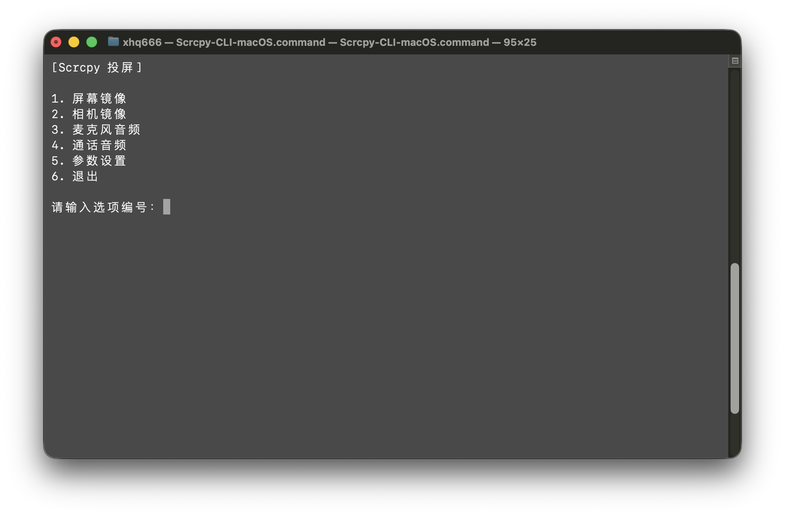

# Scrcpy CLI Launcher

[English](./README.md) | 简体中文

一个跨平台的 Scrcpy CLI 启动器，具有设备选择、配置文件和快速访问常用镜像模式的功能。

这个项目在 `scrcpy` 和 `adb` 之上提供了一个 **交互式菜单封装**，让以下操作更方便：

- Android 屏幕镜像
- 相机镜像
- 转发麦克风与通话音频
- 切换预设启动配置
- 处理多设备连接场景
- 尝试重连处于 `offline` 状态的 ADB 设备

原始版本基于 Windows 批处理脚本实现，随后补充了 macOS 和 Linux 的 Shell 版本。

---

## 屏幕截图



## 功能

### 屏幕镜像
为选中的设备启动标准的 `scrcpy` 屏幕投屏。

### 相机镜像
使用以下参数启动 `scrcpy`：

```bash
--video-source=camera
```

支持摄像头 ID 选择，以及显示方向处理。

### 麦克风与通话音频
使用以下参数启动 **麦克风或通话音频** 模式：

```bash
--audio-source=mic --no-video
--audio-source=voice-call --no-video
```

### 配置切换
从 JSON 配置文件中读取多个配置档，并支持在不同配置之间切换。

### 多设备选择
自动检测所有 ADB 设备，并让你选择要操作的目标设备。

### 离线设备重连
当设备状态为 `offline` 时，脚本会尝试执行：

```bash
adb disconnect <device>
adb connect <device>
```

---

## 支持平台

- **Windows**：`.bat`
- **macOS**：`.command`
- **Linux**：`.sh`

---

## 依赖要求

脚本依赖以下工具：

- **adb**
- **scrcpy**
- **Python 3**

其中 **Python 3** 主要用于 Shell 版本中的 JSON 解析与配置读取。

---

## 安装

### Windows
请安装：

- `adb`
- `scrcpy`
- `PowerShell`（现代 Windows 一般已内置）

并确保 `adb` 与 `scrcpy` 已加入 `PATH`。

### macOS
使用 Homebrew 安装：

```bash
brew install android-platform-tools scrcpy
```

### Linux
常见包管理器示例如下。

#### Debian / Ubuntu
```bash
sudo apt install adb scrcpy python3
```

#### Fedora
```bash
sudo dnf install android-tools scrcpy python3
```

#### Arch Linux
```bash
sudo pacman -S android-tools scrcpy python
```

这些命令包含 **`sudo`**，会修改系统已安装的软件包。执行前请确认软件源可靠，并清楚它会对系统环境产生影响。

---

## 配置文件

启动器默认从以下路径读取配置：

```text
~/scrcpy_config.json
```

### Windows
通常对应类似路径：

```text
C:\Users\你的用户名\scrcpy_config.json
```

### macOS / Linux
通常对应类似路径：

```text
/Users/你的用户名/scrcpy_config.json
```

或者：

```text
/home/你的用户名/scrcpy_config.json
```

---

## 配置格式

支持两种 JSON 结构。

### 格式 A：`profiles` 对象

```json
{
  "selected": "default",
  "profiles": {
    "default": {
      "display_mirror": "--max-size 1600",
      "camera_mirror": "--video-bit-rate 8M"
    },
    "high_quality": {
      "display_mirror": "--max-size 2560 --video-bit-rate 20M",
      "camera_mirror": "--video-bit-rate 20M"
    }
  }
}
```

### 格式 B：平铺配置对象

```json
{
  "selected": "default",
  "default": {
    "display_mirror": "--max-size 1600",
    "camera_mirror": "--video-bit-rate 8M"
  },
  "high_quality": {
    "display_mirror": "--max-size 2560 --video-bit-rate 20M",
    "camera_mirror": "--video-bit-rate 20M"
  }
}
```

### 字段说明

| 字段 | 说明 |
|------|------|
| `selected` | 当前选中的配置名称 |
| `display_mirror` | 屏幕镜像附加参数 |
| `camera_mirror` | 相机镜像附加参数 |

---

## 使用方法

### Windows
运行：

```bat
Scrcpy-CLI-Windows.bat
```

### macOS
赋予执行权限后运行：

```bash
chmod +x Scrcpy-CLI-macOS.command
./Scrcpy-CLI-macOS.command
```

也可以直接在 Finder 中双击 `.command` 文件运行。

### Linux
赋予执行权限后运行：

```bash
chmod +x Scrcpy-CLI-Linux.sh
./Scrcpy-CLI-Linux.sh
```

---

## 菜单选项

启动器主要提供以下操作：

1. **Screen Mirror**
2. **Camera Mirror**
3. **Microphone Audio**
4. **Profile Selection**
5. **Exit**

---

## 相机镜像说明

使用相机模式时，启动器会以摄像头源模式启动 `scrcpy`，并根据所选摄像头 ID 应用对应的显示方向。

命令大致形式如下：

```bash
scrcpy -s <device> --video-source=camera --camera-id=<id> <camera_args> --display-orientation=<orientation>
```

---

## 音频模式说明

麦克风模式使用：

```bash
scrcpy -s <device> --audio-source=mic --no-video
```

这会在不启动视频流的情况下转发音频。

---

## 安全说明

这些脚本相对轻量，主要会执行：

```bash
adb devices
adb disconnect
adb connect
scrcpy ...
```

脚本本身 **不会主动**：

- 删除文件
- 修改分区
- 格式化磁盘
- 更改防火墙规则
- 改动启动设置

不过，`adb` 和 `scrcpy` 仍然会与已连接的 Android 设备交互，所以在执行前，最好确认你选中的到底是哪台设备，别让自动化突然开始整活。

---

## 补充说明

- Windows 版本使用 **PowerShell** 解析 JSON。
- macOS 与 Linux 版本使用 **Python 3** 解析 JSON。
- Shell 版本应尽量避免不安全的 `eval` 风格解析。
- 部分 `scrcpy` 功能是否可用，取决于你安装的具体版本。

---

## 许可证

本项目采用 **MIT License** 授权，详情请参见仓库根目录下的 [LICENSE](./LICENSE) 文件。

---

## 致谢

本项目构建于以下工具之上：

- **scrcpy**
- **adb**

感谢 `scrcpy` 项目完成真正的重活。
